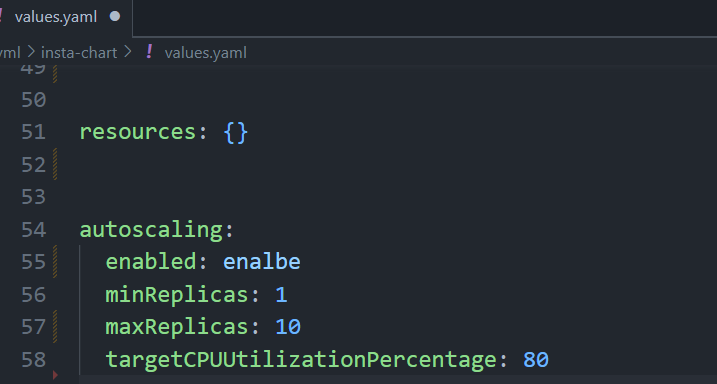

# instabug_
## [GitHub Repo](https://github.com/gAhmedg/instabug_.git)- link of me project
## 1- Dockerfile that build the app 
### use alpine to make it lightweight 

## 2-Pipeline job 
### jenkinsfile to build the app using dockerfile and pushed a docker image to dockerhub 
### you can pull it from this command

```
docker push algn48/go-insta2
```
## 3-Docker compose
### contains both application and mysql database

## 4-Helm manifests
### \instabug\yml in the path have Chart and the basic yaml file with services 

## 5-Add autoscaling manifest  
### autoscaling with minimum and maximum replica
 
 ### number of replicas
 